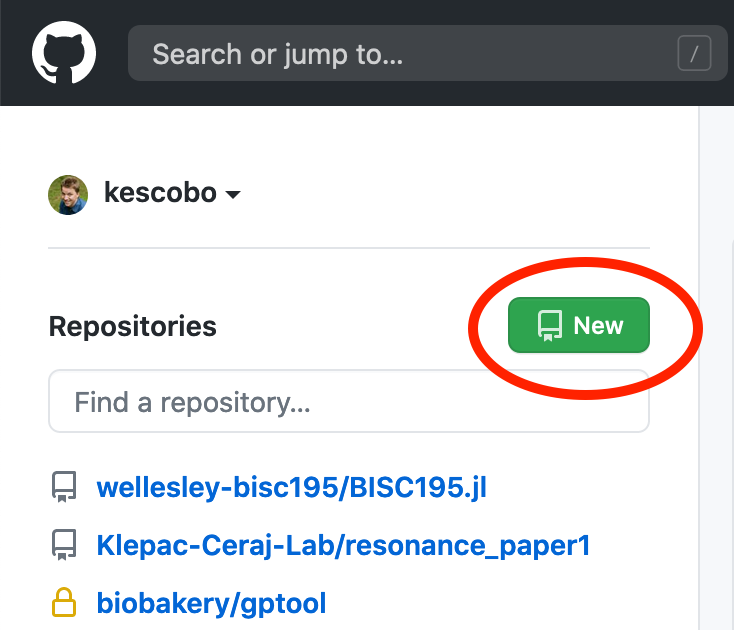
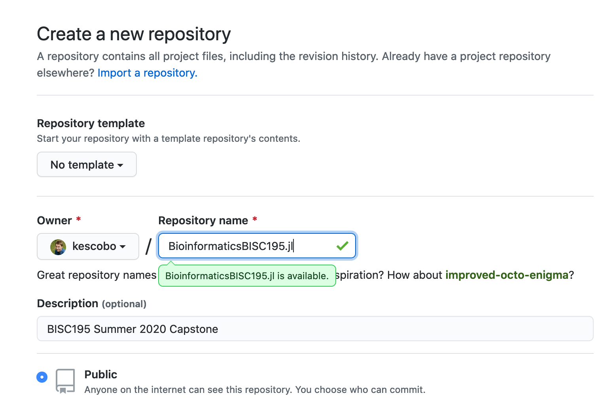

+++
number = 8
title = "Getting set up"
release = Date(2021,07,1)
due_date = Date(2021,07,6)
+++

{{assignment_preamble}}
## Check list

There are a lot of different tasks introduced in this assignment,
and you will not have automated tests to tell you when you're done.
Here's a checklist to help you keep track,
which Kevin will add to your github repo once you've created it and shared it with him.

- [ ] Code repo (from Assignment 7), renamed and in public repo
  - [ ] tests still passing
- [ ] Analysis repo complete
  - [ ] README has heading 1 title and bold author line
  - [ ] `Project.toml` with code repo, `Pluto`, `PlutoUI`, `Revise`, `DataFrames`, and `Plots` as dependencies
  - [ ] `data/` directory with explanation for how to download data
    - [ ] `cov-sequences.fasta`
  - [ ] `notebooks/` directory with `1-sequence-stats.jl` or `1-sequence-stats.md`
    - [ ] Including code and description for calculating mean
          and standard deviations  for sequence length and gc content

## Wrapping up Assignment07 Package

In the [previous assignment](/assignments/Assignment07),
we created a julia package that you're going to be re-using
for the rest of the course.
But it doesn't have a very good name,
and at the moment, your assignments are in private repos,
which makes some stuff (like using it for automated tests) harder.

@@colbox-orange
@@title
Warning
@@
Before continuing, make sure that you've successfully completed
assignment 7 and all of the tests are passing
@@

First, let's make a new, public home for your bioinformatics package.

1. On github, create a new repository:

   
2. Give it a good name - Julia package names usually end with `.jl`.
   Be sure that the repo is set to `public`.
   
3. Copy the url of the repository
   
   
4. On your computer, navigate to your `Assignment07-<username>` directory.
   We are now going to point `git` to this new location,
   so that when you make new changes in the future,
   they will go there instead.

   In the terminal,

   ```sh
   $ git remote set-url origin <paste URL here>
   $ git push -u origin trunk
   Enumerating objects: 61, done.
   Counting objects: 100% (61/61), done.
   Delta compression using up to 12 threads
   Compressing objects: 100% (46/46), done.
   Writing objects: 100% (61/61), 76.07 KiB | 1.46 MiB/s, done.
   Total 61 (delta 21), reused 24 (delta 7), pack-reused 0
   remote: Resolving deltas: 100% (21/21), done.
   To github.com:kescobo/BioinformaticsBISC195.jl.git
    * [new branch]      trunk -> trunk
   Branch 'trunk' set up to track remote branch 'trunk' from 'origin'.
   ```
5. Now let's rename the module in the julia code.
   Open the assignment _directory_ in VS Code.
   There are a few places that the module name currently exists -
   use `cmd+shift+F` (`ctrl+shift+F` on Windows) to open the search panel
   (you can also click the magnifying glass icon in the sidebar)
   and search for `Assignment07`. 

   Replace `Assignment07` with whatever you named your module,
   and then rename the main module file at `src/Assignment07.jl`.
6. Commit and push your changes.
7. Back on github, click on the `Settings` tab for your repository,
   then on `Manage access`, and add Kevin (`@kescobo`) as a collaborator.

## Building an analysis repository

Now, we'll create a new project to handle our analyses of SARS-CoV2 genomes.
While it is possible to keep everything in the same directory,
it's a good idea to keep code that may be useful in many projects
(such as your bioinformatics functions)
separate from code that is used for one specific purpose.

1. Open a terminal, and create a new directory with `mkdir` for CoV2 analysis
   (you can put it in the same directory as your other assignments,
   but don't put it _inside_ any of those assignments).
   Use `cd` to make this new directory your working directory,
   then enter `git init` to make this into a git repository.
2. On github, create a new repository, copy its url,
   and use `git remote add` to set this as `origin`
   (refer [back to lesson 2](/lessons/Lesson02)) if you need
   a reminder about how these commands work).

   ```sh
   $ git remote add origin <url>
   ```

   Don't forget to add Kevin as a collaborator.
3. Create a directory inside this repo called `notebooks`,
   and another called `data`.
4. Open the analysis directory in VS Code.
   Create a file called `README.md`,
   give it a title (use markdown to make the title Heading 1 format),
   and add `By <your name>` under the title in bold.
5. Commit and push your changes.
   Remember, the first time you push, you need to say _where_ to push:

   ```sh
   $ git push --set-upstream origin master
   ```

   Take a look at the repo on github -
   your README should show up, correctly formatted,
   but the directories won't show up until there are committed files in them.
6. Add a file called `data.md` to the `data/` directory -
   This is where we'll describe how to get the data that we're going to analyze,
   but you can leave it blank for now
7. Create a file in the `notebooks/` directory called `1-sequence-stats.jl` if you want to use Pluto.jl,
   or `1-sequence-stats.md` if you want to use a pure markdown notebook.
8. Commit and push your changes.

At this point, you should have a git repo with the following structure:

```
./MyAnalysis
├── data
│   └── data.md
├── notebooks
│   └── 1-sequence-stats.jl # or 1-sequence-stats.md
└── README.md
```

## Getting the data

An enormous amount of data has been generated
on SARS-CoV2 (the virus) and COVID-19 (the disease caused by CoV2).
You can get links to much of it [on NCBI](https://www.ncbi.nlm.nih.gov/sars-cov-2/) -
the National Center for Biotechnology Information.

We're particularly interested in the genome sequences
of SARS-related corona viruses.
Go to the [Virus search page](https://www.ncbi.nlm.nih.gov/labs/virus/vssi/#/virus?SeqType_s=Nucleotide&VirusLineage_ss=SARS-CoV-2,%20taxid:2697049),
and use the search function to see all of the genomes of
SARS-CoV (Severe accute respiratory syndrom-related Coronavirus),
MERS-CoV (Middle East repiratory syndrom-related Coronavirus),
and SARS-CoV2 (the virus that causes COVID19).

Refine the search a bit by selecting only complete genomes
(under "Nucleotide completeness").
When I wrote this assignment last year, there were just under 7300 such records.
As I write this in 2021, there are over 360,000.
There may be more when you search.

To cut this number down a bit,
restrict the number of ambiguous characters to 50,
and only take genomes from Asia, South America, and Africa.

The search parameters you enter are stored in the url.
Copy the url and put it into your `data/data.md` file,
explaining what it is, and the date you did the search.
It's always a good idea to keep track of where data comes from
so that your work is reproducible by someone else.

Click "download", make sure "Nucleotide" under "Sequence data (FASTA format)
is selected, and download all records.
When it asks about the FASTA definition line (the header),
build a custom header and be sure to include the Accession number
(this is a unique identifier),
the species, the isolation source, and the Geo location.

Download the sequences, and put them into your `data/` directory
with a more descriptive name than `sequences.fasta`.
Be sure to describe what you did in `data/data.md`.

@@colbox-green
@@title
Tip
@@

Usually, it's not a good idea to add and commit large files
like genome sequences to the git repository,
especially if those files are likely to change often
(since `git` stores a record of all of the different versions).

To avoid commiting it, and to make `git` forget about trying to track it,
you can create a file called `.gitignore` inside your repo,
and put `data/<filename>` in it.
Be sure to add and commit the `.gitignore` file!
@@

## Setting up julia project

Open a julia REPL in your analysis directory
(you can do this from VS Code
or by opening a new REPL and using `cd()`).

Now, activate the environment from the Pkg REPL,
and use `dev` (short for `develop`)
to install your bioinformatics project.
To do this, you can use the path (relative or absolute)
to the bioinformatics project directory.

For example, if it is in your `Documents/` directory,
you might enter

```julia-repl
pkg> dev /Users/<username>/Documents/BioinformaticsBISC195
```

@@colbox-blue
@@title
Note
@@
As with `$` in shell prompts, the `pkg>` is an indicator
that you should be using the Pkg REPL (accessible by pressing `]`),
and isn't part of the actual command.
@@

Once you've done this, you will be able to do `using BioinformaticsBISC195`
in your julia code, as long as this julia project is active.

In addition, use `add` to install the packages
`Pluto`, `PlutoUI`, `Revise`, `Plots`, and `DataFrames`
We'll use those a bit more later.

Add and commit the `Project.toml` and `Manifest.toml` files,

## Using the notebook

There are many different paradigms for "code notebooks",
such as [R markdown](https://rmarkdown.rstudio.com) and [Jupyter](https://jupyter.org).
Most of these paradigms are available for julia code as well,
but we're going to use a platform that's unique to julia - [Pluto.jl](https://www.youtube.com/watch?v=IAF8DjrQSSk) -
which allows you to generate "reactive" notebooks.

There are a few things different about a Pluto notebook
than the code that you have tended to write until now,
But before we see examples of that,
let's get the pluto notebook up and running.

In the `notebooks/1-sequence-stats.md` file,
write julia code to calculate the mean and standard deviation
of the lengths and gc content of your coronavirus genomes,
as you did in [Assignment 6](/assignments/Assignment06).
Include a title (with header format)
and a description of what your code is doing.

Remember, you can use the code you've written
in your bioinformatics package just by doing `using <PackageName>`.
Also remember,
in markdown files, julia code should go in "code fences."
Eg.

````md
# Some Coronavirus Analysis

Here's some description of what I'm doing.
I downloaded coronavirus geneomes from NCBI
(see `data/data.md` for more details)

Etc.

```julia
using BioinformaticsBISC195

genomes = parse_fasta("../data/cov2_sequences.fasta")
```

Now I have the genomes, and need to do stats.
Note - your descriptions should be... more descriptive.

```julia
using Statistics
#more code...

```

etc..
````

If you're using VS Code to edit your markdown,
and have both the `julia` and `markdown julia` extensions installed,
you can execute code within code fences
in exactly the same way as you've been doing in `.jl` files.

## No tests

There are no automated tests for your analysis code -
this is research, I don't know what the right answer is!

But this means that it's extra important that you add extra checks
to make sure the code is doing what you intend.